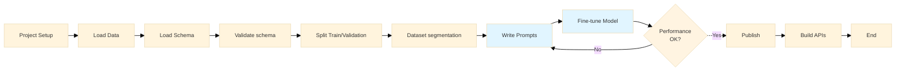

### Arepas Project Workflow

## Workflow Stages

### 1. Project Setup
- Initialize project structure
- Install dependencies
- Configure environment

### 2. Load Datasets
- Load building datasets from CSV files
- Associate images with records
- Organize by neighborhood

### 3. Load Schema
- Load Discover Denver Schema (55 fields)
- Parse field definitions, sections, and survey levels

### 4. Schema Validation
- Validate each record against schema
- Generate validation reports
- Identify missing/invalid fields

### 5. Split Data
- Divide into training and validation datasets
- Ensure representative distribution
- Maintain data integrity

### 6. Setup Fine Tuning Environment
- Configure OpenAI Vision API
- Prepare data format for fine-tuning
- Set up training parameters

### 7-8. Iterative Loop: Write Prompts → Fine Tune Model
**This loop repeats until model performance is acceptable:**

- **Write prompts**: Create/refine prompts for architectural classification
- **Fine tune model**: Train OpenAI Vision model with current prompts
- **Evaluate**: Assess model performance
- **Iterate**: If performance is insufficient, refine prompts and repeat

### 9. Publish Model
- Deploy fine-tuned model
- Version and document model
- Make available for production use

### 10. Build and Test APIs
- Create API endpoints
- Integrate model
- Test functionality and performance
