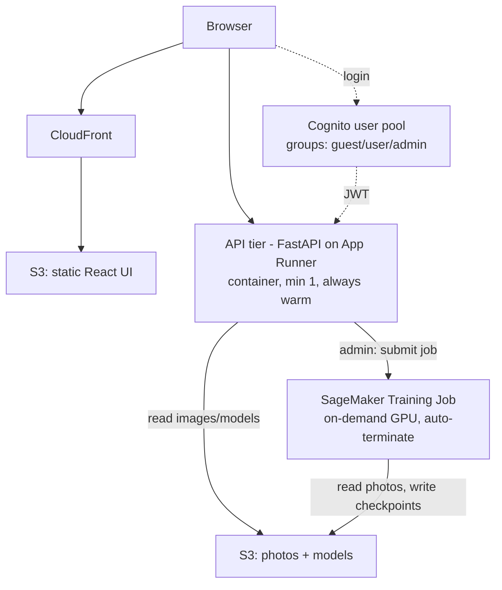

# Arepas — AWS Deployment & User Management Plan

Status: **Approved, pending implementation** · Date: 2026-07-06

This document captures the agreed architecture, user-management model, cost
estimates, and phased build plan for deploying Arepas to AWS. It is a design
reference; no infrastructure has been provisioned yet.

---

## 1. Goals

- Deploy the existing FastAPI backend, React/Vite frontend, and PyTorch
  (EfficientNet-B5) model to AWS.
- Add simple user management with three roles:
  - **guest** — inference only (anonymous, no login)
  - **user** — inference + explore
  - **admin** — inference + explore + train
- Match cost to usage: **inference is invoked rarely**, **training is heavy but
  occasional**. The expensive tier must scale to zero when idle.
- Store all photos and models in S3 and access them from code when deployed.
- Keep it simple and effective — no deep implementation detail in this plan.

---

## 2. Locked decisions

| Concern | Decision |
|---|---|
| Inference + Explore API tier | **AWS App Runner** (container, **min 1 instance, always warm**) |
| Training tier | **SageMaker Training Jobs** (on-demand GPU, auto-terminate; managed spot) |
| Auth | **Amazon Cognito** user pool with 3 groups |
| Guest access | **Anonymous / no login** (default role, inference only) |
| Storage | **S3** — 3 buckets (data, models, frontend) |
| Frontend | **S3 + CloudFront** (static build) |
| Config / secrets | **SSM Parameter Store**; IAM roles (no access keys) |

> **Decision change (2026-07-10):** inference tier moved **Lambda → App Runner
> (min 1)**. The original "rarely invoked → scale-to-zero" assumption didn't hold:
> inference is UI-driven (~20–50/day at random times) with a **1–15 s** latency
> expectation, and the Explore endpoints must be **always available**. That usage
> is the worst case for Lambda cold starts (sparse but interactive; a B5 +
> GroundingDINO container cold-starts 30–60 s). App Runner min-1 keeps the
> container warm for ~$45–65/mo, runs the app under uvicorn unchanged (no Mangum),
> and exposes a built-in HTTPS endpoint (**no API Gateway**). Scale-to-zero is
> deliberately traded for a predictable ~1–3 s response.

### Assumed defaults (override if needed)

- Region: **us-east-1**
- No custom domain initially (use CloudFront for the UI + the App Runner default HTTPS domain for the API)
- Single **prod** environment first; tfvars structured to add dev later

---

## 3. Architecture



### Component → AWS service → rationale

| Concern | Service | Rationale |
|---|---|---|
| Frontend (React/Vite) | S3 + CloudFront | Static build; pennies/month, globally cached. |
| Inference + Explore API | AWS App Runner (container, min 1) | UI-driven inference (1–15 s SLA) + always-on Explore; sparse-but-interactive traffic is the worst case for Lambda cold starts. B5 + GroundingDINO on CPU, kept warm. ~$45–65/mo. |
| Training | SageMaker Training Jobs | Admin submits a job → GPU spins up, runs, writes to S3, **auto-terminates**. Pay per second. |
| Auth / users | Amazon Cognito + 3 groups | Managed JWT; role travels in the `cognito:groups` claim. |
| Storage | S3 (photos, models, static) | Single source of truth. |
| Config | SSM Parameter Store | Bucket names, model keys, region — no secrets in code. |

---

## 4. Storage strategy (S3)

Three buckets (or one bucket with three prefixes):

- `arepas-data/` — photos (`data/`, `data2/`, `data3/`) + `crops/` — **~125 GB**
- `arepas-models/` — checkpoints + `training_history.json` / `run_notes.json`
- `arepas-frontend/` — built UI

**Access pattern (minimal app change):** a small storage abstraction resolves
paths to the local filesystem when running locally and to S3 when
`AREPAS_S3_BUCKET` is set. Compute uses **IAM roles** (no keys):

- API (App Runner) instance role → **read** photos + models.
- Training role → **read** photos, **write** models.

Inference loads the chosen checkpoint from `arepas-models/` at startup and
caches it (kept warm by the min-1 instance). A one-time `aws s3 sync` seeds the
buckets.

Measured local footprint (2026-07-06): data 0.5 GB · data2 23 GB · data3 94 GB ·
crops 6.6 GB → **~125 GB photos+crops**; a few GB of models worth keeping.

---

## 5. User management (3 roles)

Cognito groups → JWT claim → a single FastAPI dependency enforces the minimum
role per route.

| Role | inference | explore | train |
|---|:---:|:---:|:---:|
| **guest** (anonymous) | ✅ | ❌ | ❌ |
| **user** | ✅ | ✅ | ❌ |
| **admin** | ✅ | ✅ | ✅ |

### Role → endpoint map

| Group | Endpoints |
|---|---|
| inference (all roles) | `POST /inference`, `GET /checkpoints` |
| explore (user + admin) | `GET /datasets`, `/datasets/{d}/neighborhoods`, `/datasets/{d}/buildings/search`, `/datasets/{d}/buildings/{id}`, `GET /runs`, `/runs/{id}/history` |
| train (admin only) | **NEW** `POST /train` (submits a SageMaker job) |

---

## 6. Cost estimate

All estimates: us-east-1, on-demand unless noted. Training is **per-run /
usage-driven**, not a fixed monthly charge.

### Shared baseline (every scenario)

| Item | Assumption | $/mo |
|---|---|---|
| S3 storage | ~135 GB Standard | ~$3 |
| CloudFront + S3 static UI | low traffic | ~$1 |
| Cognito | handful of users (10k MAU free) | $0 |
| SSM Parameter Store | standard tier | $0 |
| Route 53 (if custom domain) | 1 hosted zone | ~$1 |
| **Baseline subtotal** | | **~$5/mo** |

### Inference tier

| Option | Idle cost | Per 1,000 inferences | Notes |
|---|---|---|---|
| **App Runner min-1 (chosen)** | **~$45–65/mo** | negligible | Always warm → ~1–3 s responses; meets the 1–15 s UI SLA + always-on Explore. |
| Lambda (container) | ~$0 | ~$1 | Rejected: 30–60 s cold start on the B5+GroundingDINO image; sparse-but-interactive traffic hits it constantly. |
| Fargate (24/7) | ~$85–100 | negligible | Always warm; needs a load balancer. More infra than App Runner. |

### Training tier (per-run, $0 when not training)

| Option | Instance | On-demand $/hr | ~Cost per 30-epoch run\* |
|---|---|---|---|
| **SageMaker (chosen)** | ml.g5.xlarge (A10G 24 GB) | ~$1.41 | ~$15–30 (~$5–12 managed spot) |
| On-demand GPU EC2 | g5.xlarge | ~$1.01 | ~$10–20 (~$3–9 spot) |
| Cheaper GPU | g4dn.xlarge (T4 16 GB) | ~$0.53 | ~$8–15 (slower / tighter memory) |

\*Assumes ~10–20 GPU-hours for a full run. Spot cuts ~60–70%.

⚠️ **Risk:** a self-managed EC2 GPU left running by accident ≈ **$730/mo**.
SageMaker auto-terminates when the job ends, avoiding this.

### Bottom line — chosen bundle (App Runner min-1 + SageMaker spot)

| Scenario | Inference/API | Training (~2 runs/mo) | Baseline | **Total /mo** |
|---|---|---|---|---|
| **Chosen** | ~$45–65 (always warm) | ~$10–24 | ~$5 | **~$60–95** |
| Lambda (rejected) | ~$1–10 | ~$10–24 | ~$5 | ~$20–40 (but fails the latency SLA) |

The ~$40–55/mo premium over Lambda buys a predictable ~1–3 s response and
always-on Explore — the deliberate trade for a UI-facing tool. Training remains
the only usage-driven (per-run) cost.

---

## 7. Build plan (phased)

Because this spans well over 3 files, work proceeds **one phase at a time**,
each with its own describe → approve → implement → edge-cases loop.

| Phase | Scope | Files |
|---|---|---|
| **0. Storage abstraction** | Path resolver (local FS vs S3 via `AREPAS_S3_BUCKET`), wired into loader/inference/runs | app code (~2–3) |
| **1. S3 + upload** | Buckets, IAM, one-time `aws s3 sync` of photos/crops/models | `infra/s3.tf`, `providers.tf`, `variables.tf` |
| **2. Auth** | Cognito pool + 3 groups + anonymous guest; FastAPI role dependency on routers | `infra/cognito.tf`, app auth dep |
| **3. Inference + Explore API on App Runner** | Containerize FastAPI (uvicorn); App Runner service (min 1) + IAM instance role; **S3 dataset discovery + image URLs (0c)** so Explore works with no local data | `infra/apprunner.tf`, `Dockerfile`, discovery/url code |
| **4. Frontend** | React build → S3 + CloudFront, wire Cognito login + API URL | `infra/frontend.tf`, UI config |
| **5. Training on SageMaker** | Job template/config + admin-only `POST /train` that submits the job | `infra/training.tf`, config JSON, new endpoint |
| **6. Hardening** | Fail-safe + robustness pass across Phases 0–2 (see §9) | `src/api/auth.py`, `src/storage/s3.py`, `infra/s3.tf`, tests/CI |

### Proposed Terraform + config layout (names only)

```
infra/
  main.tf, variables.tf, outputs.tf, providers.tf
  s3.tf         # 3 buckets + policies
  cognito.tf    # user pool + 3 groups + app client
  apprunner.tf  # App Runner service (min 1) + IAM instance role
  frontend.tf   # CloudFront + S3 website
  training.tf   # SageMaker role / job template
  ssm.tf        # config params
config/
  deploy.dev.tfvars, deploy.prod.tfvars
  sagemaker_training_job.json   # instance type, image, hyperparams
```

---

## 8. Open items (refinements, non-blocking)

- Region confirmation (assumed us-east-1).
- Custom domain (assumed none initially).
- Rough inferences/month and training runs/month (to tighten cost to a single number).

---

## 9. Hardening backlog (Phase 6)

Items surfaced in the principal-level review of Phases 0–2 (2026-07-09). None are
architectural; all are fail-safe / robustness improvements deferred to a dedicated
hardening pass. (Remote Terraform state / locking is intentionally **excluded** —
acceptable for a single operator.)

### Correctness (highest priority)

- **Auth: validate `token_use` (id vs access).** `verify_token` checks
  `audience=client_id`, which only Cognito **ID** tokens satisfy; **access**
  tokens have no `aud` claim. If the SPA sends the access token (common), every
  request 401s. Add an explicit `token_use` check and accept the token type the
  frontend actually sends. Will otherwise bite in Phase 4.
- **Auth: fail closed in production.** The dev bypass resolves every request as
  `admin` when no Cognito pool is configured. A prod deploy that forgets
  `AREPAS_COGNITO_USER_POOL_ID` would silently open the API to everyone as admin.
  Require an explicit `AREPAS_AUTH_MODE=cognito` in prod (fail closed if unset).

### Robustness

- **Storage: make `S3Storage.local_path` concurrency-safe.** Two processes
  downloading the same key share one `.part` filename → race. Use a
  per-process/`tempfile` suffix before the atomic rename.
- **Storage: guard `open_image`** against zero-byte / non-image objects with a
  clear error instead of a raw `PIL` exception.
- **Auth: handle JWKS fetch/rotation failures distinctly** — a transient Cognito
  outage should surface as 401/503, not a 500.

### Data safety

- **`prevent_destroy` on the data bucket.** Add a `lifecycle { prevent_destroy = true }`
  to `aws_s3_bucket.data` so a stray `terraform destroy` cannot delete the ~125 GB
  of irreplaceable survey photos. (Consider the same for the models bucket.)
- **S3 access logging + lifecycle tiering** (minor at current scale/cost).

### Process

- **Wire the standalone test scripts into CI** (`scripts/test_storage.py`,
  `test_auth.py`, `test_phase3_multipart_parsing.py`) so regressions are caught
  on every change rather than by manual runs.
