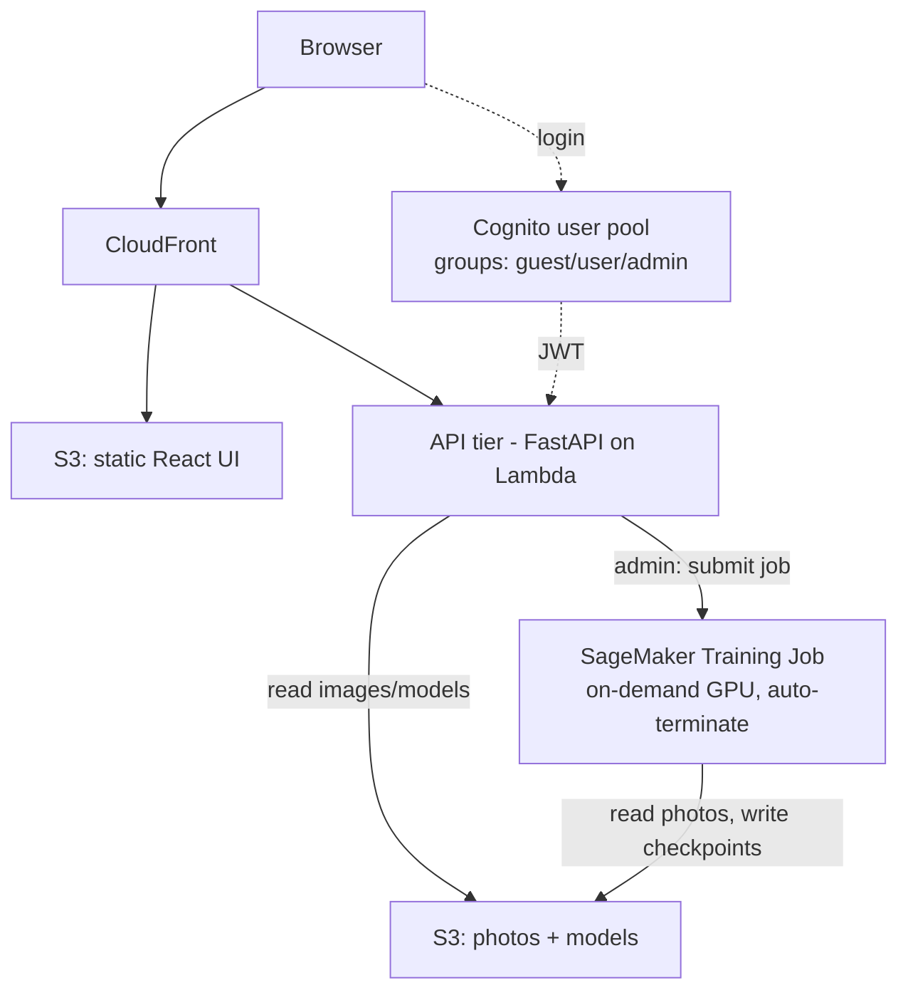

# Arepas — AWS Deployment & User Management Plan

Status: **Approved, pending implementation** · Date: 2026-07-06

This document captures the agreed architecture, user-management model, cost
estimates, and phased build plan for deploying Arepas to AWS. It is a design
reference; no infrastructure has been provisioned yet.

---

## 1. Goals

- Deploy the existing FastAPI backend, React/Vite frontend, and PyTorch
  (EfficientNet-B5) model to AWS.
- Add simple user management with three roles:
  - **guest** — inference only (anonymous, no login)
  - **user** — inference + explore
  - **admin** — inference + explore + train
- Match cost to usage: **inference is invoked rarely**, **training is heavy but
  occasional**. The expensive tier must scale to zero when idle.
- Store all photos and models in S3 and access them from code when deployed.
- Keep it simple and effective — no deep implementation detail in this plan.

---

## 2. Locked decisions

| Concern | Decision |
|---|---|
| Inference tier | **AWS Lambda** (container image, CPU, scale-to-zero) |
| Training tier | **SageMaker Training Jobs** (on-demand GPU, auto-terminate; managed spot) |
| Auth | **Amazon Cognito** user pool with 3 groups |
| Guest access | **Anonymous / no login** (default role, inference only) |
| Storage | **S3** — 3 buckets (data, models, frontend) |
| Frontend | **S3 + CloudFront** (static build) |
| Config / secrets | **SSM Parameter Store**; IAM roles (no access keys) |

### Assumed defaults (override if needed)

- Region: **us-east-1**
- No custom domain initially (use CloudFront + API Gateway default domains)
- Single **prod** environment first; tfvars structured to add dev later

---

## 3. Architecture



### Component → AWS service → rationale

| Concern | Service | Rationale |
|---|---|---|
| Frontend (React/Vite) | S3 + CloudFront | Static build; pennies/month, globally cached. |
| Inference + Explore API | AWS Lambda (container) + API Gateway | Rarely invoked → scale-to-zero = near-zero idle cost. B5 inference runs on CPU. |
| Training | SageMaker Training Jobs | Admin submits a job → GPU spins up, runs, writes to S3, **auto-terminates**. Pay per second. |
| Auth / users | Amazon Cognito + 3 groups | Managed JWT; role travels in the `cognito:groups` claim. |
| Storage | S3 (photos, models, static) | Single source of truth. |
| Config | SSM Parameter Store | Bucket names, model keys, region — no secrets in code. |

---

## 4. Storage strategy (S3)

Three buckets (or one bucket with three prefixes):

- `arepas-data/` — photos (`data/`, `data2/`, `data3/`) + `crops/` — **~125 GB**
- `arepas-models/` — checkpoints + `training_history.json` / `run_notes.json`
- `arepas-frontend/` — built UI

**Access pattern (minimal app change):** a small storage abstraction resolves
paths to the local filesystem when running locally and to S3 when
`AREPAS_S3_BUCKET` is set. Compute uses **IAM roles** (no keys):

- Lambda role → **read** photos + models.
- Training role → **read** photos, **write** models.

Inference loads the chosen checkpoint from `arepas-models/` on cold start and
caches it. A one-time `aws s3 sync` seeds the buckets.

Measured local footprint (2026-07-06): data 0.5 GB · data2 23 GB · data3 94 GB ·
crops 6.6 GB → **~125 GB photos+crops**; a few GB of models worth keeping.

---

## 5. User management (3 roles)

Cognito groups → JWT claim → a single FastAPI dependency enforces the minimum
role per route.

| Role | inference | explore | train |
|---|:---:|:---:|:---:|
| **guest** (anonymous) | ✅ | ❌ | ❌ |
| **user** | ✅ | ✅ | ❌ |
| **admin** | ✅ | ✅ | ✅ |

### Role → endpoint map

| Group | Endpoints |
|---|---|
| inference (all roles) | `POST /inference`, `GET /checkpoints` |
| explore (user + admin) | `GET /datasets`, `/datasets/{d}/neighborhoods`, `/datasets/{d}/buildings/search`, `/datasets/{d}/buildings/{id}`, `GET /runs`, `/runs/{id}/history` |
| train (admin only) | **NEW** `POST /train` (submits a SageMaker job) |

---

## 6. Cost estimate

All estimates: us-east-1, on-demand unless noted. Training is **per-run /
usage-driven**, not a fixed monthly charge.

### Shared baseline (every scenario)

| Item | Assumption | $/mo |
|---|---|---|
| S3 storage | ~135 GB Standard | ~$3 |
| CloudFront + S3 static UI | low traffic | ~$1 |
| Cognito | handful of users (10k MAU free) | $0 |
| SSM Parameter Store | standard tier | $0 |
| Route 53 (if custom domain) | 1 hosted zone | ~$1 |
| **Baseline subtotal** | | **~$5/mo** |

### Inference tier

| Option | Idle cost | Per 1,000 inferences | Notes |
|---|---|---|---|
| **Lambda (chosen)** | **~$0** | ~$1 | 10–20 s cold start on first call after idle. |
| App Runner (min 1) | ~$25–50 | negligible | Always warm. |
| Fargate (24/7) | ~$42–85 | negligible | Always warm; + ALB ~$16 if used. |

### Training tier (per-run, $0 when not training)

| Option | Instance | On-demand $/hr | ~Cost per 30-epoch run\* |
|---|---|---|---|
| **SageMaker (chosen)** | ml.g5.xlarge (A10G 24 GB) | ~$1.41 | ~$15–30 (~$5–12 managed spot) |
| On-demand GPU EC2 | g5.xlarge | ~$1.01 | ~$10–20 (~$3–9 spot) |
| Cheaper GPU | g4dn.xlarge (T4 16 GB) | ~$0.53 | ~$8–15 (slower / tighter memory) |

\*Assumes ~10–20 GPU-hours for a full run. Spot cuts ~60–70%.

⚠️ **Risk:** a self-managed EC2 GPU left running by accident ≈ **$730/mo**.
SageMaker auto-terminates when the job ends, avoiding this.

### Bottom line — chosen bundle (Lambda + SageMaker spot)

| Scenario | Inference | Training (~2 runs/mo) | **Total /mo** |
|---|---|---|---|
| **Lean (chosen)** | ~$1–10 | ~$10–24 | **~$20–40** |
| Always-warm (reference) | ~$42–85 | ~$20–40 | ~$70–130 |

Near-zero when idle; real spend only during the occasional training run.

**Cost sensitivity — the three numbers that move the total:**
1. Inference volume (Lambda scales with it; still ~$8 even at 10k/mo).
2. Training frequency (~$5–30/run; 4 runs/mo ≈ $20–120).
3. Warm vs scale-to-zero inference (the $0 vs $40–85 fork).

---

## 7. Build plan (phased)

Because this spans well over 3 files, work proceeds **one phase at a time**,
each with its own describe → approve → implement → edge-cases loop.

| Phase | Scope | Files |
|---|---|---|
| **0. Storage abstraction** | Path resolver (local FS vs S3 via `AREPAS_S3_BUCKET`), wired into loader/inference/runs | app code (~2–3) |
| **1. S3 + upload** | Buckets, IAM, one-time `aws s3 sync` of photos/crops/models | `infra/s3.tf`, `providers.tf`, `variables.tf` |
| **2. Auth** | Cognito pool + 3 groups + anonymous guest; FastAPI role dependency on routers | `infra/cognito.tf`, app auth dep |
| **3. Inference on Lambda** | Containerize FastAPI, Lambda + API Gateway, read-model-from-S3 role | `infra/api.tf`, `Dockerfile` |
| **4. Frontend** | React build → S3 + CloudFront, wire Cognito login + API URL | `infra/frontend.tf`, UI config |
| **5. Training on SageMaker** | Job template/config + admin-only `POST /train` that submits the job | `infra/training.tf`, config JSON, new endpoint |

### Proposed Terraform + config layout (names only)

```
infra/
  main.tf, variables.tf, outputs.tf, providers.tf
  s3.tf         # 3 buckets + policies
  cognito.tf    # user pool + 3 groups + app client
  api.tf        # Lambda(container) + API Gateway + IAM role
  frontend.tf   # CloudFront + S3 website
  training.tf   # SageMaker role / job template
  ssm.tf        # config params
config/
  deploy.dev.tfvars, deploy.prod.tfvars
  sagemaker_training_job.json   # instance type, image, hyperparams
```

---

## 8. Open items (refinements, non-blocking)

- Region confirmation (assumed us-east-1).
- Custom domain (assumed none initially).
- Rough inferences/month and training runs/month (to tighten cost to a single number).
